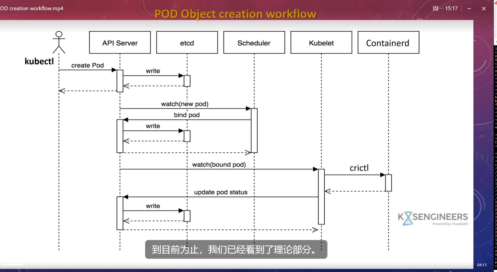

# Kubernetes Pod 对象创建流程

1. 用户通过 `kubectl apply`（声明式）或 `kubectl run`（命令式）提交 Pod 创建请求。
2. API Server 验证请求并写入 etcd。
3. API Server通知Scheduler未绑定的 Pod，选定节点并更新 Pod 的 `nodeName` 字段后写入 etcd。
4. Kubelet 接收到新调度 Pod，调用 Container Runtime 创建并启动容器。
5. Kubelet 将 Pod 状态（如 `Running`）回写 API Server → etcd。
6. 用户通过 `kubectl get pod` 等命令查看 Pod 状态与详细信息。
